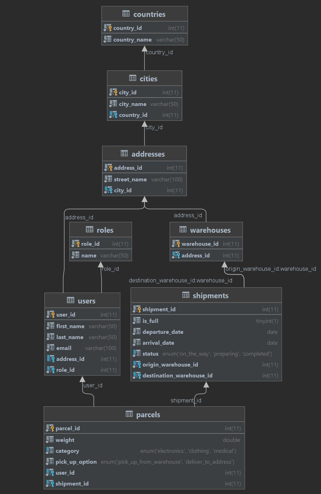

# Deliver IT

## Description
We are happy to present you **DeliverIT** - a web application that serves the needs of a freight forwarding company! 
The program consists of countries, cities, addresses, warehouses, shipments, parcels, users and user roles.

## Technologies used:
* **JDK 11**
* **Spring Boot framework**
* **MariaDB**
* **Hibernate**

## How to build the project:
Firstly, you need to download the project folder. 

You also need a MariaDB database which you can create and fill using the provided scripts.

Then you should edit the settings in the **application.properties** file in **\deliver-it\src\main\resources**.

After completing the previous steps, you can run the **DeliverItApplication.class**

## Swagger Documentation:
We have also provided a Swagger API Documentation that is accessible at http://ip-address/swagger-ui/index.html

## Database Relations

